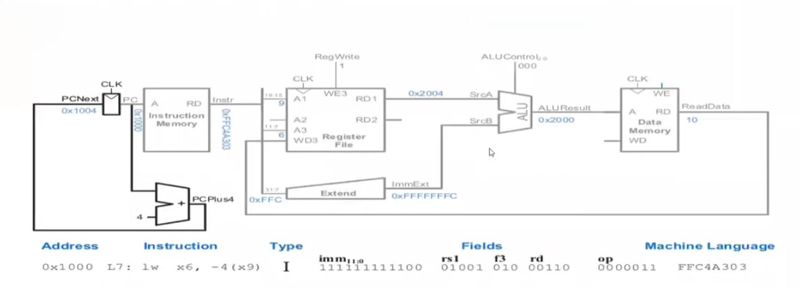

# rv_single_cycle

# RV Single Cycle

A single-cycle RISC-V (RV32I) processor datapath and control unit implemented in Verilog. Every instruction fetches, decodes, executes, accesses memory, and writes back within one clock cycle, following the classic single-cycle design from *Digital Design and Computer Architecture (RISC-V Edition)*.

## Datapath Overview

`single_cycle_top.v` wires together the following modules:

- **`program_counter.v`** — `pc_module`: registers the current PC, updates on the rising clock edge, resets to 0 on `rst`
- **`pc_adder.v`** — computes `PC + 4` (`PCPlus4`) each cycle
- **`instruction_memory.v`** — 1024-word instruction ROM, word-addressed via `A[31:2]`, loaded at simulation start from `memfile.hex` via `$readmemh`
- **`register_file.v`** — 32×32-bit register file with two async read ports (`RD1`, `RD2`) and one synchronous write port (`WD3`), gated by `WE3` (`RegWrite`)
- **`sign_extend.v`** — sign-extends the 12-bit I-type or S-type immediate to 32 bits, selected by `ImmSrc[0]`
- **`alu.v`** — performs add, subtract, AND, OR, and set-less-than, and reports `Carry`, `OverFlow`, `Zero`, `Negative` flags
- **`control_unit_top.v`** — combines `main_decoder.v` and `alu_decoder.v` to generate all control signals from the opcode/funct3/funct7 fields
- **`data_memory.v`** — 1024-word data RAM, byte-addressed by `ALUResult`, written on `MemWrite`
- **`mux.v`** — generic 2-to-1 32-bit mux, reused for the ALU's second operand (register vs. immediate) and the register write-back value (ALU result vs. memory read data)

### Signal flow



## Supported Instructions

Based on `main_decoder.v` and `alu_decoder.v`:

| Type | Instructions | Opcode |
|---|---|---|
| R-type | `add`, `sub`, `and`, `or`, `slt` (funct3/funct7-selected) | `0110011` |
| I-type (load) | `lw` | `0000011` |
| S-type (store) | `sw` | `0100011` |

> **Note:** the main decoder also derives `Branch` and a `2'b10` `ImmSrc` case for opcode `1100011` (`beq`), but `Control_Unit_Top`'s `Branch` output is left unconnected in `single_cycle_top.v`, and there is no PC-select mux — `PC_Next` is hardwired to `PCPlus4`. Branch instructions are decoded but do not currently affect control flow. I-type ALU-immediate instructions (`addi`, `andi`, `ori`, …) are not yet decoded by the main decoder (`ALUSrc`/`ImmSrc` are only asserted for `lw`/`sw`).

## Known Issues / TODO

- **Filename/include mismatch:** `single_cycle_top.v` has `` `include "control_unit_top.v" `` but the actual file is named `control_unit_top.v` — rename the file or fix the include so the design compiles cleanly.
- **Branching is unimplemented:** wire `Branch` (and the ALU `Zero` flag) into a PC-select mux to support `beq`.
- **No I-type ALU immediates** (`addi`, `slti`, `andi`, `ori`, `xori`, shifts) — extend `main_decoder.v` to recognize opcode `0010011`.
- Register file and data memory are preloaded with hardcoded test values in their `initial` blocks (`Register[5]`, `Register[6]`, `mem[28]`) — remove or parameterize for general use.

## Project Structure

```
rv_single_cycle/
├── alu.v                    # ALU: add/sub/and/or/slt + flags
├── alu_decoder.v            # Generates ALUControl from ALUOp/funct3/funct7
├── control_unit_top.v      # Top-level control unit (main_decoder + alu_decoder)
├── main_decoder.v           # Generates RegWrite, ImmSrc, ALUSrc, MemWrite, ResultSrc, Branch, ALUOp
├── data_memory.v            # 1024-word data RAM
├── instruction_memory.v     # 1024-word instruction ROM (loaded from memfile.hex)
├── mux.v                    # Generic 2-to-1 32-bit mux
├── pc_adder.v                # PC + 4 adder
├── program_counter.v        # PC register
├── register_file.v          # 32x32-bit register file
├── sign_extend.v             # Immediate sign extension
├── single_cycle_top.v        # Top-level module wiring the full datapath
└── memfile.hex               # Instruction memory image (not included — supply your own)
```


### Before simulating
1. Create a `memfile.hex` containing the hex machine code for the program you want to run (one instruction per line, in the format expected by `$readmemh`), and place it alongside `instruction_memory.v`.

### Simulate
```bash
iverilog -o sim.out single_cycle_top.v tb_single_cycle_top.v
vvp sim.out
gtkwave dump.vcd
```
> You'll need to write a testbench (`tb_single_cycle_top.v`) that instantiates `single_cycle_top`, drives `clk`/`rst`, and dumps signals to a `.vcd` file — none is included in the uploaded sources.

## References

- *Digital Design and Computer Architecture, RISC-V Edition* — Sarah L. Harris & David Harris
- [RISC-V Instruction Set Manual](https://riscv.org/technical/specifications/)

## License

Specify a license (e.g. MIT) here.
